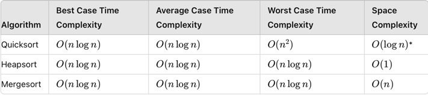

# Implementation of Quicksort Algorithm

## Description

I implemented the quicksort algorithm in Java. This was just for practice. In an actual project the built-in sort function should be used (see the function sortDescInJava()).

### Implementation

- Chooses the leftmost element as the pivot.
- Initializes two pointers, i starting just right of the pivot and j starting at the end of the array.
- Uses a while loop to find elements to swap:
  - i moves right until it finds an element less than or equal than the pivot.
  - j moves left until it finds an element greater to the pivot.
  - If i is less than j, it swaps the elements at i and j.
- Once i surpasses j, it swaps the pivot with the element at j if the digits[j] > digits[p] to place the pivot in its correct sorted position.
- Now we know, that atleast the pivot element is at the right place. At last, a recursive call repeats the
  whole procedure for each digit left.

## Features

- Pivot Selection: Uses always the pivot on the left
- In-Place Sorting: Sorts the array without requiring additional space.
- Edge Case Handling: Includes checks for edge cases such as negative integers.
- Comprehensive Tests: A set of unit tests covering typical, edge, and performance cases.
- Performance Analysis: Detailed performance comparison with other sorting algorithms, including Merge Sort and Heap Sort, in the README file.

## Further Improvements

- Pivot Selection: Always choosing the one on the left is simple but can lead to a lot worst case scenarios
if the number is sorted or reverse sorted. The "Median of Three" approach could improve the partitioning leading to
less worst case scenarios. 
- Partition Scheme: The partition scheme could be changed to Lomuto or Hoare for wider recognition. 

## Quicksort vs Mergesort vs Heapsort

Source: ChatGPT

### Summary:

**Quicksort**: Efficient on average with O(n log n) time complexity, but can degrade to O(n^2) in the worst case if poorly implemented or with certain input patterns. It has low space complexity O(log n), making it suitable for in-place sorting.

**Heapsort**: Always guarantees O(n log n) time complexity in all cases. It has a constant space complexity O(1) and is efficient in practice for external sorting or when stability is not required.

**Mergesort**: Consistently provides O(n log n) time complexity. It is stable and guarantees O(n) space complexity due to the need for additional memory during merging. Mergesort is suitable for scenarios where stable sorting and predictable performance are desired, and additional space usage is not a constraint.